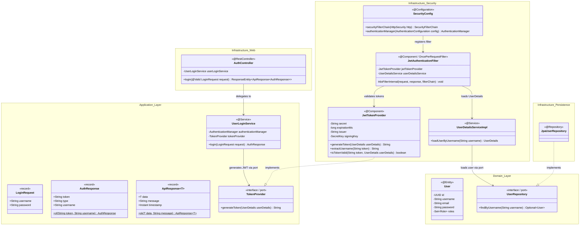
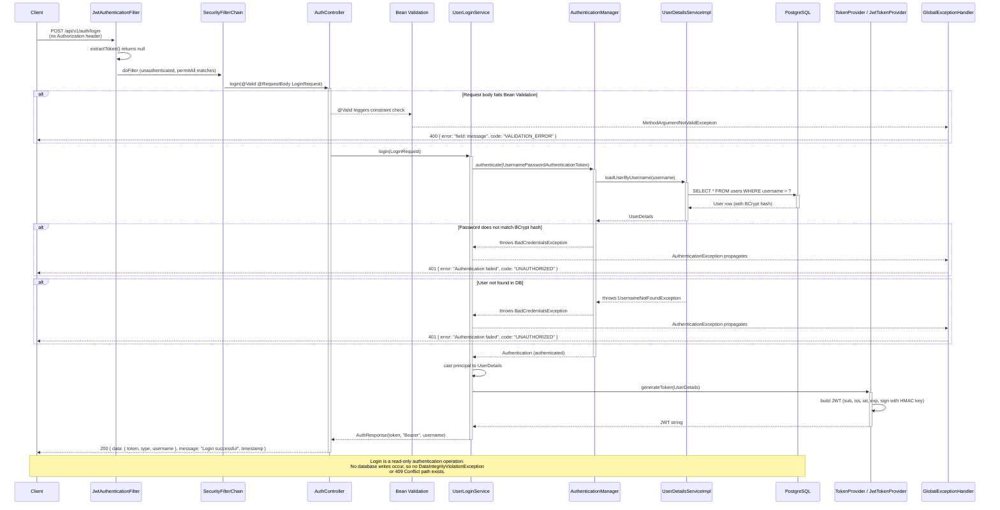

# POST /api/v1/auth/login

> **Status:** Retroactive design document. Implementation already merged. Created to address security audit findings and fulfill the TL documentation requirement.

---

## Context

The login endpoint authenticates existing users by verifying their credentials against the database (via Spring Security's `AuthenticationManager`) and returns a signed JWT on success. It is a public, unauthenticated endpoint exposed under the `/api/v1/auth/**` permit-all rule in `SecurityConfig`.

This endpoint reuses the existing `AuthResponse` DTO (shared with the register flow) and introduces `LoginRequest` as a new input DTO. The `UserLoginService` lives in the application layer and depends on two infrastructure-provided abstractions: `AuthenticationManager` (Spring Security) and `TokenProvider` (hexagonal port).

Login is a **read-only authentication operation** -- it does not write to the database. Therefore, no race condition / `DataIntegrityViolationException` / 409 path exists. This is documented explicitly per CLAUDE.md rules: the race condition sequence is only required for write endpoints.

---

## Class Diagram (Mermaid)



---

## Sequence Diagram (Mermaid)



---

## Input Validation Detail

### LoginRequest Fields

| Field      | Constraint                                                    | Reason                                                                                              |
|------------|---------------------------------------------------------------|-----------------------------------------------------------------------------------------------------|
| `username` | `@NotBlank`                                                   | Reject null, empty, and whitespace-only values before reaching the DB                               |
| `username` | `@Size(min=3, max=50)`                                        | Match the `User.username` column size (VARCHAR 50) and minimum length business rule                  |
| `username` | `@Pattern(regexp="^[a-zA-Z0-9_]+$")`                         | Prevent injection characters; only alphanumeric + underscore allowed                                |
| `password` | `@NotBlank`                                                   | Reject null, empty, and whitespace-only values                                                      |
| `password` | `@Size(min=8, max=128)`                                       | Match minimum password policy; max=128 prevents BCrypt DoS (BCrypt truncates at 72 bytes but the upper bound avoids unnecessarily large payloads) |

### Cross-DTO Consistency (LoginRequest vs RegisterRequest)

| Field      | LoginRequest                                                  | RegisterRequest                                                | Status     |
|------------|---------------------------------------------------------------|----------------------------------------------------------------|------------|
| `username` | `@NotBlank @Size(min=3, max=50) @Pattern("^[a-zA-Z0-9_]+$")` | `@NotBlank @Size(min=3, max=50) @Pattern("^[a-zA-Z0-9_]+$")`  | Consistent |
| `password` | `@NotBlank @Size(min=8, max=128)`                             | `@NotBlank @Size(min=8, max=128)`                              | Consistent |

Both DTOs now have identical constraints on shared fields. The `@Pattern` constraint on `LoginRequest.username` was added in commit `0cc69e5` to resolve a prior inconsistency flagged in the codebase state snapshot.

### Path Variables

None. This endpoint uses a request body only.

---

## Architecture Decisions

### AD-1: Hexagonal Layer Compliance

`UserLoginService` depends on `TokenProvider` (application-layer port interface), not on `JwtTokenProvider` directly. The `AuthenticationManager` is a Spring Security abstraction injected by the framework. Both dependencies respect the hexagonal rule that application-layer code never imports from infrastructure.

### AD-2: `@PreAuthorize` on Public Auth Endpoint (Auditor Finding #2)

**Decision: Intentionally omitted. No `@PreAuthorize` annotation on `UserLoginService.login()`.**

**Justification:** The login endpoint is, by definition, called by unauthenticated users. Applying `@PreAuthorize("permitAll()")` would be semantically misleading -- it implies an authorization decision is being made when none is. The access control for this endpoint is handled at the `SecurityFilterChain` level via `.requestMatchers("/api/v1/auth/**").permitAll()`. Adding a redundant annotation provides no security benefit and creates false confidence that method-level security is active.

This is an explicit exception to the CLAUDE.md rule that `@PreAuthorize` must be applied at the service layer. The rule's intent is to prevent endpoints from being accidentally exposed without authorization checks. For authentication endpoints (login, register), the permit-all decision is inherently correct and is enforced by `SecurityConfig`.

**Action:** Document this exception in CLAUDE.md as a recognized pattern for auth endpoints. Any future endpoint that is NOT under `/api/v1/auth/**` must have `@PreAuthorize` at the service layer without exception.

### AD-3: Missing Test for `@Pattern` Constraint (Auditor Finding #3)

**Gap identified:** There is no dedicated `@WebMvcTest` case verifying that a username with invalid characters (e.g., `"user@name!"`) returns 400 with the pattern violation message. The `@Pattern` constraint was added in commit `0cc69e5` but no corresponding test was added at that time.

**Required test case:**
```java
@Test
void login_usernameInvalidPattern_returns400() throws Exception {
    LoginRequest request = new LoginRequest("user@name!", "validPass123");
    mockMvc.perform(post("/api/v1/auth/login")
            .contentType(MediaType.APPLICATION_JSON)
            .content(objectMapper.writeValueAsString(request)))
        .andExpect(status().isBadRequest())
        .andExpect(jsonPath("$.error").value(
            containsString("must contain only letters, digits, or underscores")));
}
```

**Status:** ⚠️ GAP CONFIRMED — This test does NOT exist in the current codebase. Commit `2b4299f` added `login_usernameTooShort_returns400` and `login_unexpectedException_returns500WithSafeBody`, but `login_usernameInvalidPattern_returns400` was never implemented. Must be added in a follow-up fix.

### AD-4: Rate Limiting on Public Login Endpoint (Auditor Finding #4)

**Risk:** The login endpoint is public and unauthenticated. Without rate limiting, it is vulnerable to brute-force credential attacks and credential stuffing.

**Recommended approach (implementation deferred):**

1. **Short-term (before production):** Add a servlet filter or Spring interceptor implementing a per-IP sliding window rate limit. Recommended: 5 requests per minute per IP on `/api/v1/auth/login`. Use an in-memory `ConcurrentHashMap` with TTL entries for single-instance deployments, or Redis-backed counters for multi-instance.

2. **Alternative:** Use `bucket4j-spring-boot-starter` which integrates cleanly with Spring Boot and supports both in-memory and distributed (Redis/Hazelcast) backends.

3. **Response on limit exceeded:** Return `429 Too Many Requests` with a `Retry-After` header. Add a handler in `GlobalExceptionHandler` for the rate limit exception type.

4. **Infrastructure-level complement:** If deployed behind a reverse proxy (nginx, AWS ALB), configure connection-rate limiting there as a defense-in-depth layer. Application-level limiting remains necessary for per-user/per-endpoint granularity.

**Status:** A `TODO` comment exists in `AuthController` (line 19) noting this requirement. Implementation is deferred but must be completed before any production deployment.

### AD-5: JWT Audience Claim Not Validated (Auditor Finding #5)

**Current state:** `JwtTokenProvider.generateToken()` sets `subject`, `issuer`, `issuedAt`, and `expiration`. It does NOT set an `audience` claim. `isTokenValid()` checks subject, expiration, and issuer but not audience.

**Decision: Defer audience claim implementation. Document as a known gap.**

**Justification:** The audience claim (`aud`) is primarily valuable in multi-service architectures where a token issued for Service A should not be accepted by Service B. SecureUserAPI is currently a single-service application. Adding an audience claim now would be speculative engineering with no immediate security benefit.

**When to revisit:** If SecureUserAPI tokens are ever consumed by a second service (e.g., a separate admin dashboard, a mobile BFF, or a microservice), the audience claim must be added immediately. At that point:
- `generateToken()` must set `.audience().add("secureuserapi-v1")`
- `isTokenValid()` must verify `claims.getAudience().contains("secureuserapi-v1")`
- The audience value should be configurable via `application.properties` (`jwt.audience`)

**Status:** Tracked as a known gap. No code change required at this time.

### AD-6: No Race Condition Path

Login authenticates via `SELECT` (read) and generates a JWT in memory. No `INSERT` or `UPDATE` occurs. Therefore, `DataIntegrityViolationException` cannot be thrown and a 409 sequence path is not applicable. This is the correct design -- race condition documentation is only required for write endpoints per CLAUDE.md rules.

### AD-7: Error Message Opacity

The `GlobalExceptionHandler` returns `"Authentication failed"` for all `AuthenticationException` subtypes (bad password, user not found, account locked). This is intentional -- distinguishing between "user not found" and "wrong password" would leak user enumeration information to an attacker.

---

## Security Checklist

- [x] JWT validated (signature, expiration, claims) -- `JwtTokenProvider.isTokenValid()` checks signature (via `verifyWith`), expiration, issuer, and subject match. Audience deferred (see AD-5)
- [N/A] Path variables constrained with regex or type -- no path variables on this endpoint
- [x] Request body validated with Bean Validation -- `@Valid` on controller, `@NotBlank`, `@Size`, `@Pattern` on all DTO fields
- [x] No native queries with string concatenation -- `UserDetailsServiceImpl` uses Spring Data method naming (`findByUsername`)
- [x] No sensitive data in logs or error responses -- password never logged; `AuthResponse` contains only token, type, username; error messages are generic
- [x] Paired DTOs have consistent field constraints -- `LoginRequest` and `RegisterRequest` have identical `username` and `password` constraints (verified in table above)
- [x] Race condition path documented -- explicitly documented as not applicable (read-only operation, see AD-6)
- [x] JWT filter uses `catch (JwtException | IllegalArgumentException)` -- verified in `JwtAuthenticationFilter` line 44 (not `catch (Exception)`)
- [ ] `@PreAuthorize` applied at service layer -- intentionally omitted for this public auth endpoint (see AD-2 for justification)
- [ ] Rate limiting noted if endpoint is public -- **GAP**: rate limiting is documented as a requirement (see AD-4) but not yet implemented. Must be completed before production deployment
- [ ] JWT audience claim validated -- **DEFERRED**: not validated, documented as a known gap for single-service architecture (see AD-5)
