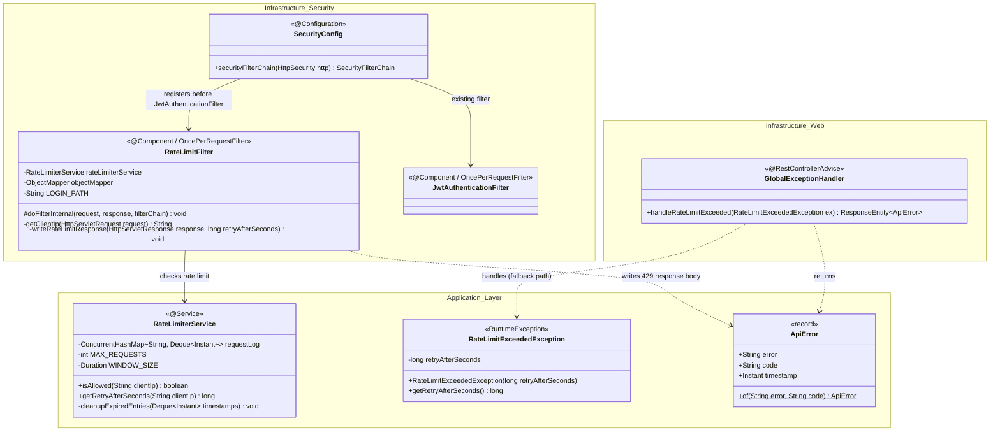
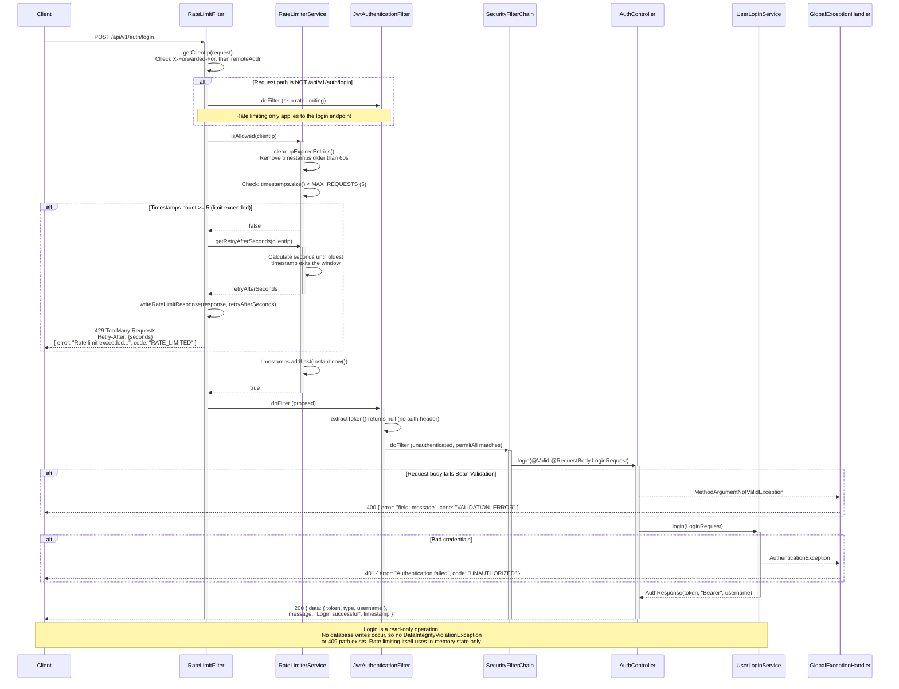

# Rate Limiting for POST /api/v1/auth/login

> **Status:** Design document. Implementation pending.  
> **Addresses:** GAP-2 from `docs/audit/login-audit-report.md`  
> **Priority:** High -- blocks production deployment.

---

## Context

The login endpoint (`POST /api/v1/auth/login`) is public and unauthenticated by design. Without rate limiting, it is vulnerable to brute-force credential attacks and credential stuffing. The audit report (GAP-2) flagged this as a production blocker, and a `TODO` comment exists in `AuthController` (line 19) acknowledging the requirement.

This design introduces a servlet filter (`RateLimitFilter`) that enforces a **per-IP sliding window** rate limit of **5 requests per minute** on the login endpoint only. The solution is in-memory (no external dependencies) using `ConcurrentHashMap` with timestamp-based sliding windows, appropriate for this project's single-instance deployment model.

The filter sits in the Spring Security filter chain **before** `JwtAuthenticationFilter`, so rate-limited requests are rejected before any authentication logic executes. When the limit is exceeded, the filter returns `429 Too Many Requests` with a `Retry-After` header and a JSON error body matching the project's `ApiError` envelope.

A new custom exception (`RateLimitExceededException`) is introduced for cases where rate limit violations need to be handled through `GlobalExceptionHandler` (e.g., future use in interceptors or annotations). However, the primary enforcement path is the servlet filter, which writes the 429 response directly without propagating through the controller layer.

---

## Class Diagram (Mermaid)



---

## Sequence Diagram (Mermaid)



---

## Input Validation Detail

### Rate Limit Filter -- Input Analysis

| Input | Source | Validation | Reason |
|-------|--------|------------|--------|
| Client IP | `X-Forwarded-For` header, fallback to `request.getRemoteAddr()` | Use only the **first** IP in `X-Forwarded-For` (leftmost = original client). Reject if IP string is null or blank; default to `"unknown"` to prevent NPE. | Prevents spoofed multi-hop headers from bypassing rate limiting. The leftmost IP is the one added by the first trusted proxy. |
| Request path | `request.getServletPath()` | Exact match against `/api/v1/auth/login` | Ensure rate limiting is scoped only to the login endpoint, not applied globally. |

### No Request Body Validation in Filter

The filter does not inspect or validate the request body. Body validation remains the responsibility of `@Valid` on the controller parameter, which executes after the filter allows the request through. This preserves separation of concerns: the filter handles rate enforcement, the controller handles input validation.

### Path Variables

None. The login endpoint has no path variables.

### X-Forwarded-For Security Consideration

If deployed behind a reverse proxy, `X-Forwarded-For` can be trusted. If deployed directly (no proxy), an attacker can spoof this header to bypass rate limiting. The implementation must document this assumption. For this portfolio/demo app deployed in development mode, `request.getRemoteAddr()` is the primary source, with `X-Forwarded-For` checked first only when a proxy is expected.

---

## Architecture Decisions

### AD-1: Servlet Filter vs. Spring Interceptor vs. bucket4j

**Decision:** Custom `OncePerRequestFilter` in the `infrastructure.security` package.

**Alternatives considered:**

1. **`bucket4j-spring-boot-starter`** -- Adds an external dependency for a feature that requires ~80 lines of custom code. Bucket4j is excellent for distributed rate limiting (Redis/Hazelcast backends), but this project is single-instance with no distributed state needed. Adding a library dependency for a portfolio project obscures understanding of the underlying mechanism.

2. **Spring `HandlerInterceptor`** -- Executes after the Spring Security filter chain, meaning rate-limited requests would still pass through JWT validation. A servlet filter placed before `JwtAuthenticationFilter` rejects requests earlier in the pipeline, saving CPU cycles on brute-force attempts.

3. **`@Aspect` / AOP** -- More complex, harder to test, and executes at the controller/service layer rather than at the HTTP boundary. Not appropriate for a cross-cutting infrastructure concern that should reject requests before they reach the application layer.

**Why servlet filter:** It intercepts requests before any Spring Security or controller logic. It can write HTTP responses directly (status code, headers, JSON body). It aligns with the existing pattern where `JwtAuthenticationFilter` is already a `OncePerRequestFilter` in the security package.

### AD-2: In-Memory ConcurrentHashMap vs. External Store

**Decision:** `ConcurrentHashMap<String, Deque<Instant>>` with lazy cleanup.

**Justification:** Single-instance deployment, no horizontal scaling requirement. An in-memory data structure is simpler, faster, and has zero external dependencies. The sliding window is implemented as a deque of timestamps per IP -- on each request, expired entries (older than 60 seconds) are pruned, then the count is checked against the limit.

**Memory risk:** In a real attack scenario, thousands of unique IPs could create entries. Mitigation: a scheduled cleanup task (`@Scheduled`) runs every 5 minutes to evict IPs whose entire deque has expired. This bounds memory growth. Worst case (10,000 unique IPs, 5 timestamps each): ~1 MB -- negligible.

### AD-3: Placement in Security Filter Chain

**Decision:** Register `RateLimitFilter` **before** `JwtAuthenticationFilter` in `SecurityConfig`.

```java
.addFilterBefore(rateLimitFilter, JwtAuthenticationFilter.class)
```

This ensures that rate-limited requests are rejected at the earliest possible point, before JWT parsing, `UserDetailsService` lookups, or database queries. Under a brute-force attack, this minimizes resource consumption.

### AD-4: Response Format Consistency

The filter writes the 429 response directly using `ObjectMapper` to serialize an `ApiError` record. This maintains the project's error envelope convention (`{ "error": "...", "code": "...", "timestamp": "..." }`) even though the response does not flow through `GlobalExceptionHandler`.

A `RateLimitExceededException` is also defined and added to `GlobalExceptionHandler` as a safety net -- if any future code path throws this exception from within the controller/service layer, it will be caught and mapped to 429 consistently.

### AD-5: Retry-After Header Calculation

The `Retry-After` header value is computed as the number of seconds until the **oldest** request in the current window expires. This tells the client exactly how long to wait before one slot opens up. If the deque has 5 entries and the oldest is 45 seconds old, `Retry-After` is `60 - 45 = 15` seconds.

### AD-6: Configuration via application.properties

Rate limit parameters (max requests, window duration) should be externalized:

```properties
rate-limit.login.max-requests=5
rate-limit.login.window-seconds=60
```

The `RateLimiterService` reads these via `@Value` or a `@ConfigurationProperties` class. This allows tuning without code changes and different values per environment (e.g., higher limits in development).

### AD-7: Scope -- Login Endpoint Only

Rate limiting is applied exclusively to `POST /api/v1/auth/login`. The register endpoint (`POST /api/v1/auth/register`) is also public, but the audit report specifically identified login as the brute-force vector. If register rate limiting is needed later, the `RateLimiterService` can be reused with a different key prefix (e.g., `"register:" + ip`).

The filter checks `request.getServletPath().equals("/api/v1/auth/login") && request.getMethod().equals("POST")` and passes all other requests through immediately.

### AD-8: No Race Condition Path

Rate limiting is a read-only check against in-memory state followed by a write to in-memory state. No database writes occur. `ConcurrentHashMap.computeIfAbsent()` and `Deque` operations within a `synchronized` block (or using `ConcurrentLinkedDeque`) handle concurrency. There is no `DataIntegrityViolationException` path or 409 scenario.

### AD-9: Hexagonal Layer Placement

| Component | Layer | Package | Justification |
|-----------|-------|---------|---------------|
| `RateLimiterService` | Application | `application.service` | Business logic for rate tracking. Stateless policy evaluation. Could be backed by Redis in the future -- keeping it in the application layer makes the implementation swappable. |
| `RateLimitFilter` | Infrastructure | `infrastructure.security` | HTTP-specific concern (servlet filter, HTTP headers, response writing). Depends on `RateLimiterService` (application port). |
| `RateLimitExceededException` | Application | `application.exception` | Application-level exception, alongside existing `DuplicateResourceException`. |

### AD-10: Testing Strategy

**Unit tests (`RateLimiterServiceTest`):**
- Allow up to 5 requests within 60s window
- Block 6th request and return correct `retryAfterSeconds`
- Allow requests again after window expires (use `Clock` injection or test with sleep)
- Handle concurrent access from same IP
- Handle multiple distinct IPs independently

**Controller slice tests (`AuthControllerTest` additions):**
- 429 response when rate limit is exceeded -- mock `RateLimiterService.isAllowed()` to return `false`
- Verify `Retry-After` header is present and numeric
- Verify response body matches `ApiError` envelope with code `"RATE_LIMITED"`
- Verify requests to `/api/v1/auth/register` are NOT rate limited

**Filter unit tests (`RateLimitFilterTest`):**
- Filter passes through non-login requests without checking rate limiter
- Filter calls `RateLimiterService` for login requests
- Filter writes correct 429 response with headers when limit exceeded
- Filter calls `doFilter` when request is allowed

### AD-11: `@PreAuthorize` Exception

Consistent with AD-2 in `docs/design/login-endpoint.md`, no `@PreAuthorize` is applied to `RateLimiterService`. The rate limiting service is an infrastructure-supporting service called by a filter, not a user-facing business operation. There is no meaningful authorization decision to enforce.

---

## Security Checklist

- [N/A] JWT validated (signature, expiration, claims) -- rate limiting occurs before JWT validation; no JWT interaction in this feature
- [N/A] Path variables constrained with regex or type -- no path variables; endpoint match is by exact servlet path string
- [N/A] Request body validated with Bean Validation -- filter does not read request body; body validation is handled by `@Valid` in `AuthController`
- [x] No native queries with string concatenation -- no database interaction; all state is in-memory
- [x] No sensitive data in logs or error responses -- 429 response contains only "Rate limit exceeded" message; client IP is not exposed in the response; IP logging uses a sanitized format (no raw `X-Forwarded-For` dump)
- [N/A] `@PreAuthorize` applied at service layer -- not applicable for filter/infrastructure service (see AD-11)
- [x] Rate limiting noted if endpoint is public -- this IS the rate limiting implementation; 5 req/min per IP on `POST /api/v1/auth/login`
- [N/A] Paired DTOs have consistent field constraints -- no new DTOs introduced
- [x] Race condition path documented -- explicitly not applicable (in-memory state only, no DB writes; see AD-8)
- [x] `Retry-After` header included in 429 response -- computed from sliding window (see AD-5)
- [x] X-Forwarded-For spoofing risk documented -- see Input Validation Detail section

---

## Ambiguities and Open Questions

**1. X-Forwarded-For trust level:** The design uses `X-Forwarded-For` when present, falling back to `remoteAddr`. In production behind a reverse proxy (nginx, ALB), this is correct. In direct-exposure scenarios, `X-Forwarded-For` can be spoofed. For this portfolio project, the risk is accepted and documented. A production deployment guide should specify that the application must sit behind a trusted proxy that overwrites `X-Forwarded-For`.

**2. Cleanup scheduling:** The design specifies a `@Scheduled` cleanup task every 5 minutes to evict expired IPs. This requires `@EnableScheduling` on a configuration class. If `@EnableScheduling` is not yet enabled in the project, the implementer must add it (likely to `SecurityConfig` or a new `SchedulingConfig` in `infrastructure.config`).

**3. Clock injection for testing:** To unit-test the sliding window without `Thread.sleep()`, `RateLimiterService` should accept a `java.time.Clock` dependency (defaulting to `Clock.systemUTC()`). Tests inject a fixed or offset clock. This is a testability concern -- the implementer should decide whether to use constructor injection or `@VisibleForTesting` setter.
