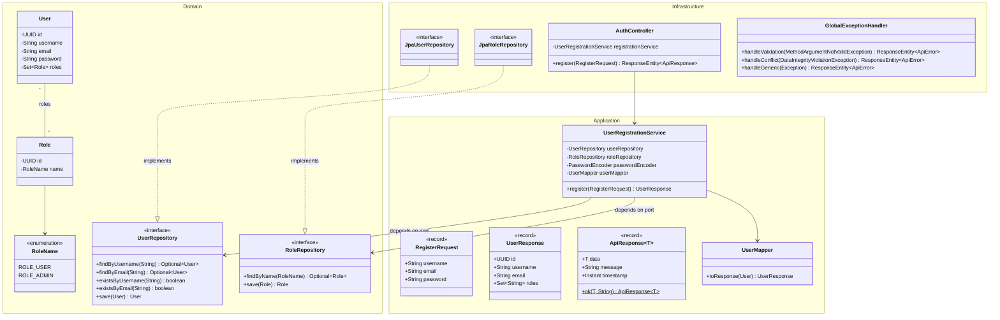
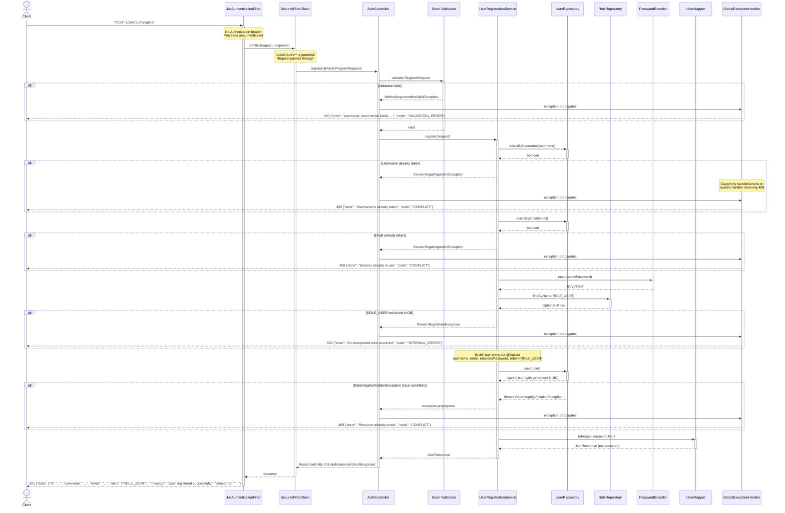

# User Registration Endpoint

## POST /api/v1/auth/register

---

| Field       | Value                                    |
|-------------|------------------------------------------|
| **Status**  | Implemented                              |
| **Version** | 1.0                                      |
| **Date**    | 2026-04-12                               |
| **Author**  | Tech Lead Agent                          |

---

### Context

This document describes the design for the user registration endpoint in SecureUserAPI. The endpoint allows new users to create an account by providing a username, email, and password. It is a public endpoint (no authentication required), positioned under `/api/v1/auth/**` which is already configured as `permitAll` in `SecurityConfig`.

The feature integrates with the existing hexagonal architecture:
- **Domain layer** already provides `User`, `Role`, `RoleName` entities and `UserRepository` / `RoleRepository` port interfaces.
- **Application layer** already provides `RegisterRequest` (validated record), `UserResponse`, `ApiResponse<T>`, `ApiError`, and `UserMapper`.
- **Infrastructure layer** already provides `JpaUserRepository`, `JpaRoleRepository`, `SecurityConfig`, `GlobalExceptionHandler`, `ApplicationConfig` (BCryptPasswordEncoder bean), and the full JWT security stack.

The components created to implement this endpoint:
1. `application/exception/DuplicateResourceException.java` — custom runtime exception for uniqueness violations.
2. `application/service/UserRegistrationService.java` — use case orchestrating registration logic.
3. `infrastructure/web/AuthController.java` — REST controller exposing the endpoint (shared with login).
4. `infrastructure/config/DataInitializer.java` — seeds `ROLE_USER` and `ROLE_ADMIN` on startup.

---

### Class Diagram (Mermaid)



---

### Sequence Diagram (Mermaid)



---

### Input Validation Detail

| Field      | Constraint                      | Annotation(s)                          | Reason                                                                 |
|------------|---------------------------------|----------------------------------------|------------------------------------------------------------------------|
| `username` | Not blank                       | `@NotBlank`                            | Empty usernames are meaningless                                        |
| `username` | 3-50 characters                 | `@Size(min = 3, max = 50)`            | Matches `users.username` column length (50). Min 3 prevents trivial names |
| `username` | Alphanumeric + underscores only | `@Pattern(regexp = "^[a-zA-Z0-9_]+$")`| **RECOMMENDATION: add this.** Prevents injection vectors and normalizes usernames |
| `email`    | Not blank                       | `@NotBlank`                            | Email is required for account recovery and uniqueness                  |
| `email`    | Valid email format              | `@Email`                               | Rejects malformed addresses before hitting the DB                      |
| `email`    | Max 100 characters              | `@Size(max = 100)`                     | Matches `users.email` column length (100)                              |
| `password` | Not blank                       | `@NotBlank`                            | Password is mandatory                                                  |
| `password` | 8-128 characters                | `@Size(min = 8, max = 128)`           | Min 8 enforces minimum strength; max 128 prevents BCrypt DoS (BCrypt truncates at 72 bytes, but 128-char limit prevents abuse of the validation layer itself) |

**Current state of `RegisterRequest`:** The existing record at `application/dto/RegisterRequest.java` has `@NotBlank`, `@Size`, and `@Email` but is missing the `@Pattern` constraint on `username`. This should be added.

**Sanitization notes:**
- `username` and `email` should be trimmed (leading/trailing whitespace) before persistence. The service layer should call `.trim()` on both fields. Alternatively, a custom `@Trimmed` annotation or manual pre-processing in the service is appropriate.
- `email` should be lowercased before persistence to avoid case-sensitive duplicates (`John@Mail.com` vs `john@mail.com`).
- `password` must never be logged, returned in responses, or included in `toString()` output. The `User` entity uses `@Getter @Setter` (not `@Data`), so no auto-generated `toString` risk.

---

### Architecture Decisions

#### 1. New Components

**`UserRegistrationService`** (`application/service/UserRegistrationService.java`)
- Annotated with `@Service` and `@Transactional`.
- Depends on domain port interfaces (`UserRepository`, `RoleRepository`), not on JPA infrastructure.
- Injected with `PasswordEncoder` (from `ApplicationConfig` bean) and `UserMapper`.
- Single public method: `register(RegisterRequest) -> UserResponse`.
- Performs uniqueness checks via `existsByUsername` / `existsByEmail` before save to provide clear error messages rather than relying solely on DB constraint violations.
- Also handles the DB constraint violation race condition via the existing `GlobalExceptionHandler.handleConflict`.

**`AuthController`** (`infrastructure/web/AuthController.java`)
- Annotated with `@RestController` and `@RequestMapping("/api/v1/auth")`.
- Single method: `@PostMapping("/register")` accepting `@Valid @RequestBody RegisterRequest`.
- Returns `ResponseEntity<ApiResponse<UserResponse>>` with HTTP 201 Created.
- No `@PreAuthorize` needed -- this is a public endpoint already configured as `permitAll`.

#### 2. Design Patterns

| Pattern              | Where                        | Why                                                                 |
|----------------------|------------------------------|---------------------------------------------------------------------|
| Port/Adapter         | `UserRepository` (port) / `JpaUserRepository` (adapter) | Keeps domain decoupled from JPA infrastructure |
| Service Layer        | `UserRegistrationService`    | Encapsulates registration use case; single responsibility           |
| Builder              | `User.builder()`             | Clean entity construction with Lombok `@Builder`                    |
| DTO (Record)         | `RegisterRequest`, `UserResponse` | Immutable data carriers; entities never cross the API boundary |
| Mapper               | `UserMapper`                 | Centralizes entity-to-DTO conversion; avoids scattered mapping logic |
| Global Exception Handler | `GlobalExceptionHandler` | Uniform error envelope across all endpoints                         |

#### 3. Custom Exception Recommendation

The current `GlobalExceptionHandler` handles `DataIntegrityViolationException` with a generic "Resource already exists" message. For the registration use case, the service should throw a custom `DuplicateResourceException` (extending `RuntimeException`) with a specific message like "Username is already taken" or "Email is already in use". A new `@ExceptionHandler(DuplicateResourceException.class)` mapping to 409 Conflict should be added to `GlobalExceptionHandler`. This provides:
- Clear, field-specific error messages to the client.
- Distinction between application-level uniqueness checks (explicit, fast) and DB-level constraint violations (race condition fallback).

```java
// application/exception/DuplicateResourceException.java
public class DuplicateResourceException extends RuntimeException {
    public DuplicateResourceException(String message) {
        super(message);
    }
}
```

#### 4. Spring Security Configuration

- `/api/v1/auth/**` is already `permitAll` in `SecurityConfig` -- no changes needed.
- The `JwtAuthenticationFilter` will run but find no token; it proceeds without setting authentication. This is correct behavior.
- No `@PreAuthorize` on the registration method since it is intentionally public.

#### 5. JPA / PostgreSQL Considerations

- **Indexes:** `users.username` and `users.email` have `unique = true` constraints, which PostgreSQL automatically backs with unique B-tree indexes. No additional indexes needed for the registration flow.
- **N+1 risk:** The `User.roles` relationship uses `FetchType.EAGER` with a `@ManyToMany` join table. For the registration endpoint this is acceptable -- we are creating a new user with exactly one role, so the eager fetch on save is a single join. However, for list/search endpoints in the future, this EAGER strategy will cause N+1 problems and should be revisited (switch to `LAZY` + `@EntityGraph` on specific queries).
- **Race condition:** Two concurrent registrations with the same username/email could both pass the `existsBy*` check. The unique DB constraint is the ultimate safeguard. The `DataIntegrityViolationException` handler in `GlobalExceptionHandler` catches this and returns 409.
- **Transaction:** `@Transactional` on the service method ensures the role lookup and user save happen in a single transaction. If `ROLE_USER` is not found, the transaction rolls back cleanly.

#### 6. ROLE_USER Seeding Prerequisite

The registration service assumes `ROLE_USER` exists in the `roles` table. A data initialization strategy is required:
- **Option A (recommended for early development):** Add a `data.sql` or `@EventListener(ApplicationReadyEvent.class)` component that seeds `ROLE_USER` and `ROLE_ADMIN` if absent.
- **Option B:** Flyway/Liquibase migration (preferred for production).

Without this, registration will fail with a 500 error.

#### 7. Rate Limiting

This is a public endpoint vulnerable to abuse (mass account creation, credential stuffing with email enumeration). Rate limiting is **required** before production deployment. Options:
- Spring Cloud Gateway rate limiter (if behind a gateway).
- Bucket4j + Spring Boot Starter for per-IP rate limiting.
- At minimum, document the requirement and add a `// TODO: rate limiting` annotation.

Recommended limit: 5 registrations per IP per minute.

#### 8. Scalability Notes

- The registration endpoint is write-heavy but low-volume relative to read endpoints. PostgreSQL handles concurrent inserts well with row-level locking on the unique constraints.
- BCrypt is intentionally slow (cost factor 10 by default). Under high load, the `PasswordEncoder.encode()` call becomes the bottleneck. If this becomes an issue, offload encoding to an async worker, but for typical registration volumes this is a non-issue.
- Horizontal scaling is safe: the endpoint is stateless (JWT, no sessions). Multiple instances behind a load balancer will work without coordination.

---

### Security Checklist

- [x] JWT validated (signature, expiration, claims) -- not applicable (public endpoint), but JWT filter runs harmlessly
- [x] Path variables constrained with regex or type -- no path variables on this endpoint
- [x] Request body validated with Bean Validation -- `@Valid` on `RegisterRequest`; `@NotBlank`, `@Size`, `@Email` present
- [ ] **Add `@Pattern` to `username` field** -- restrict to `^[a-zA-Z0-9_]+$`
- [x] No native queries with string concatenation -- all queries use Spring Data method naming
- [x] No sensitive data in logs or error responses -- password never in `UserResponse`; `GlobalExceptionHandler` strips internals
- [x] `@PreAuthorize` applied at service layer -- N/A for public registration endpoint
- [ ] **Rate limiting noted** -- must be implemented before production; currently absent
- [x] Password encoded with BCrypt before storage
- [x] Email normalized (lowercase + trim) before uniqueness check -- **must be implemented in service**
- [x] Unique constraints at DB level as race condition fallback
- [x] `ROLE_USER` assigned by server, never by client input (client cannot choose their role)
- [x] No internal entity IDs exposed beyond UUID -- UUIDs are non-sequential

---

### Implementation Summary

All components described in this document have been implemented and tested.

| File | Status | Notes |
|------|--------|-------|
| `application/dto/RegisterRequest.java` | Done | `@Pattern(regexp = "^[a-zA-Z0-9_]+$")` applied to `username` |
| `application/exception/DuplicateResourceException.java` | Done | Custom runtime exception for uniqueness violations |
| `application/service/UserRegistrationService.java` | Done | Registration use case: uniqueness checks, BCrypt encoding, role assignment, persistence |
| `infrastructure/web/AuthController.java` | Done | Shared controller with login; `@PostMapping("/register")` returns 201 |
| `infrastructure/web/GlobalExceptionHandler.java` | Done | Handles `DuplicateResourceException` (409) and `DataIntegrityViolationException` (409 race condition fallback) |
| `infrastructure/config/DataInitializer.java` | Done | Seeds `ROLE_USER` and `ROLE_ADMIN` via `@EventListener(ApplicationReadyEvent.class)` |

> **Open item:** Rate limiting on `/api/v1/auth/register` is still pending. A `// TODO: rate limiting` comment exists in `AuthController.java`. Must be resolved before production deployment.
